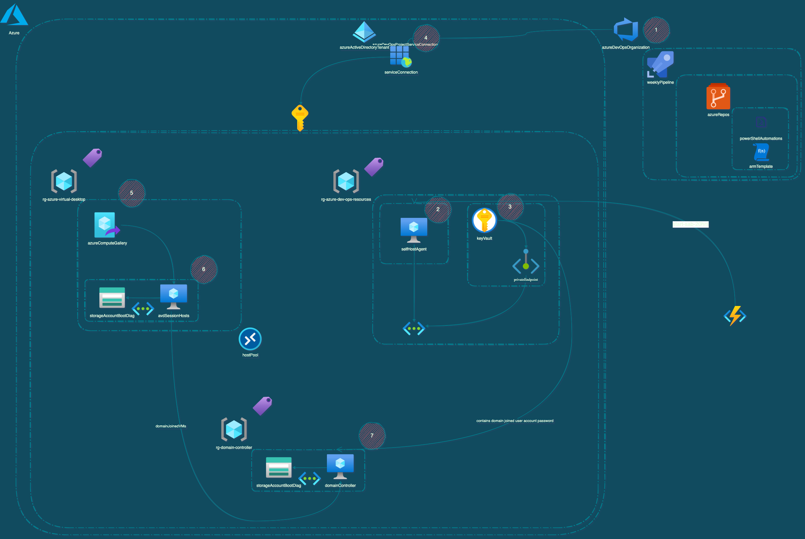

# __AZURE VIRTUAL DESKTOP - ENVIRONMENT MAINANTENCE__

This is a fork of the original source code of the AVD automation and it will be maintained by the author and community contributors.

<br><br>

 🛠 &nbsp;Technologies

&nbsp;
&nbsp;
&nbsp;
&nbsp;
&nbsp;
<br><br>

Contents:
---
- [Solution Diagram](#solution)
- [Components Description](#description-of-the-components)
    - [Azure DevOps](#azure-devops)
        - [Pipeline](#pipelines)
        - [Service Connect](#service-connect)
        - [Self Hosted Agent](#self-host-agent)
        - [Code Repository](#code-repository)
    - [Azure](#azure)
        - [AVD Host Pool](#avd-hostpool)
        - [Azure Compute Gallery](#azure-compute-gallery)
        - [Azure Key Vault](#azure-keyvaults)
    - [Active Directory Domain Services (ADDS)](#active-directory-domain-services)
        - [Organizational Unity](#organizational-unity)
        - [Domain Join Account](#domain-join-account)
    - [Powershell Automations](#powershell-automations)
        - [User Notification](#usernotificationps1)
        - [Delete AVD Session Hosts](#deletesessionhostps1)
        - [Generate AVD Registration Token](#generateavdtokenidps1)
        - [Delete ADDS Computer Acount Object](#deleteadcomputeraccountps1)
        - [Deploy AVD Session Host](#newazsessionhostdeployps1)
        - [ADD VM to LAWS ](#addvmtolawsworkspaceps1)
- [Changelog](CHANGELOG.md)
- [Contributing](#Contributing)


# __<a name="solution">Solution</a>__

This solution was developed to help Azure Administrators to automate the mainatence process of AVD Environments where is required to recreate the session hosts due a image change or even for a quick deployment in another region or azure. You can learn more about this project in [post](https://techf.cloud) on my blog.

This automation may help you with:

- Creates a deployment pattern to your session hosts.
- Keep the AVD Organization Unity Clean.
- Grant Resources Tagging.
 
The diagram below helps you to have a better understandment of how the automation works and which componentes are used on Azure and Azure DevOps.



The whole automation is executed in a pipeline that runs 6 powershell scripts, that are responsible to:

- Notify Active Users.
- Remove Session Hosts from the hostpool.
- Delete the old VM's.
- Delete the ADDS computer accounts.
- Create the new session hosts.
- (Optional) Configure the the VM's to report to a specific Log Analytics workspace in case the usage of the insights feature.

# __<a name="descriptionOfTheComponents">Description of the Components</a>__

## __<a name="azureDevOps">Azure DevOps</a>__
---
### __<a name="pipeline">Pipelines</a>__
---
The automation steps are executed via Azure DevOps Pipelines, this pipeline can be configured to be executed acording to your business requirement, below you may find some examples.

You can combine scheduled and event-based triggers in your pipelines, for example to validate the build every time a push is made (CI trigger), when a pull request is made (PR trigger), and a nightly build (Scheduled trigger). If you want to build your pipeline only on a schedule, and not in response to event-based triggers, ensure that your pipeline doesn't have any other triggers enabled. For example, YAML pipelines in a GitHub repository have CI triggers and PR triggers enabled by default. For information on disabling default triggers, see Triggers in Azure Pipelines and navigate to the section that covers your repository type.

1. Manual.

After create the pipeline, you'll need to trigger it manually from the Azure DevOps Portal.

```yml
    name: "Deploying Azure Virtual Desktop Session Host"
    trigger: none
    jobs: 
    - job: Deployment
      displayName: devOpsTask - Auto Task

```

2. Schedulled Trigger.

You can use cron tab to schedule the automation execution.

Scheduled triggers configure a pipeline to run on a schedule defined using [cron syntax.](https://learn.microsoft.com/en-us/azure/devops/pipelines/process/scheduled-triggers?view=azure-devops&tabs=yaml#cron-syntax)


```yml
schedules:
- cron: string # cron syntax defining a schedule
  displayName: string # friendly name given to a specific schedule
  branches:
    include: [ string ] # which branches the schedule applies to
    exclude: [ string ] # which branches to exclude from the schedule
  always: boolean # whether to always run the pipeline or only if there have been source code changes since the last successful scheduled run. The default is false.
```
3. Branch Trigger

When specifying a branch, tag, or path, you may use an exact name or a wildcard. Wildcards patterns allow * to match zero or more characters and ? to match a single character.

- If you start your pattern with * in a YAML pipeline, you must wrap the pattern in quotes, like "*-releases".
- For branches and tags:
    - A wildcard may appear anywhere in the pattern.
- For paths:
    - In Azure DevOps Server 2022 and higher, including Azure DevOps Services, a wildcard may appear anywhere within a path pattern and you may use * or ?.
    - In Azure DevOps Server 2020 and lower, you may include * as the final character, but it doesn't do anything differently from specifying the directory name by itself. You may not include * in the middle of a path filter, and you may not use ?.

```yml
trigger:
  branches:
    include:
    - master
    - releases/*
    - feature/*
    exclude:
    - releases/old*
    - feature/*-working
  paths:
    include:
    - docs/*.md
```

To get more details about pipeline execution, please refer to the content below:

https://learn.microsoft.com/en-us/azure/devops/pipelines/repos/azure-repos-git?view=azure-devops&tabs=yaml#pr-triggers

https://learn.microsoft.com/en-us/azure/devops/pipelines/repos/github?view=azure-devops&tabs=yaml#pr-triggers

https://learn.microsoft.com/en-us/azure/devops/pipelines/repos/azure-repos-git?view=azure-devops&tabs=yaml#pr-triggers

https://learn.microsoft.com/en-us/azure/devops/pipelines/repos/azure-repos-git?view=azure-devops&tabs=yaml#choose-a-repository-to-build


### __<a name="serviceConnect">Service Connect</a>__
---

This automation requires the usage of a service connection to execute the pipeline and succefully perform the required tasks on Azure. 

Your Microsoft Azure subscription: Create a service connection with your Microsoft Azure subscription and use the name of the service connection in an Azure Web Site Deployment task in a release pipeline.

To create a service connection you can refer to this [article](https://learn.microsoft.com/en-us/azure/devops/pipelines/library/service-endpoints?view=azure-devops&tabs=yaml#create-a-service-connection).


### __<a name="selfHostedAgent">Self-Host Agent</a>__
---

The pipeline needs to be executed from a self-host agent that communicates with the domain controllers of the domain where the session hosts are joined.

Requirements:

- [Powershell core](https://learn.microsoft.com/en-us/powershell/scripting/install/installing-powershell-on-windows?view=powershell-7.3)
- [Az Module](https://learn.microsoft.com/en-us/powershell/azure/install-az-ps?view=azps-9.3.0)
- [Az.DesktopVirtualization Module](https://learn.microsoft.com/en-us/powershell/module/az.desktopvirtualization/?view=azps-9.3.0)
- [Active Directory Module](https://learn.microsoft.com/en-us/powershell/module/activedirectory/?view=windowsserver2022-ps)


## __<a name="azure">Azure</a>__

### __<a name="avdHostPool">AVD HostPool</a>__
---

The automation requires an existant host pool in the Azure Subscription, you can also use the automation to update the hostpool RDP settings.

For more information about host pools, please take a look in the documentation below:

https://learn.microsoft.com/en-us/azure/virtual-desktop/create-host-pools-azure-marketplace?tabs=azure-portal


### __<a name="azureComputeGallery">Azure Compute Gallery</a>__
---

The automation uses the azure compute gallery image as reference for the session host deployment.

For more information about Azure Compute Gallery, please take a look in the documentation below:

https://learn.microsoft.com/en-us/azure/virtual-machines/azure-compute-gallery

### __<a name="azureKeyVault">Azure KeyVaults</a>__
---

The KeyVault is used to store:

- Domain User Join Password.
- Local Admin Password.
- AVD Registration Token.

For more information about Azure Key Vault, please take a look in the documentation below:

https://learn.microsoft.com/en-us/azure/key-vault/general/overview

### __<a name="azureIdentity">Azure Identity Assignments</a>__
---

It's required to grant access to the Service Connection in the subscription and the Key Vault.

Key Vault Permission:

https://learn.microsoft.com/en-us/azure/key-vault/general/assign-access-policy?tabs=azure-portal

> Note: For subscription, the service connection needs at least the contributor permission at the subscription level.

## __<a name="activeDirectoryDomainServices">Active Directory Domain Services</a>__

> Note: This automation only applies to scenarios where the computer are joined to an Active Directory Domain Services..

### __<a name="organizationalUnity">Organizational Unity</a>__
---

Is required to use a specific organizational unity for this automation as the script [deleteAdComputerAccount.ps1](#deleteadcomputeraccountps1) deletes all objects in the specified organizational unity.


### __<a name="domainJoinAccount">Domain Join Account</a>__
---

## __<a name="powershellAutomations">Powershell Automations</a>__

### __<a name="userNotification">userNotification.ps1</a>__
---

The [userNotification.ps1](https://github.com/frestevao/avd-sessionhost-automation/blob/4baa71d5ee1db64a08e768bcfb8e6315b2b04a93/powershellAutomations/userNotification/userNotification.ps1) is responsible to check if the available session hosts contains any active session and, if the session state is equal __"Active"__, the script sends a notification to the user desktop warning them that the environment will unavailable for a couple of minutes. It also allows the user to end their pending tasks (by default, the script waits 5 minutes)

The message is tottaly customized and you can change it in the variable ```$messageBody```, below you find the parameters used.

```pwsh 
#AVD user notification section
Write-Host (Get-Date -Format 'MM/dd/yyyy HH:mm:ss').ToString() " = [WARNING] The user Session is active!"
Write-Host (Get-Date -Format 'MM/dd/yyyy HH:mm:ss').ToString() " = [WARNING] Sending an alert to the user"

logState -state "WARNING" -logMessage "Sending notification to the active users"

#Generating user details variables

$userName = $activeSession.ActiveDirectoryUserName.Split('\')[1]                    
Write-Host (Get-Date -Format 'MM/dd/yyyy HH:mm:ss').ToString() " = [INFO] logged user name" $userName 
logState -state "INFO" -logMessage "Logged user name: " $userName  $logFileName

#Message Section
[string]$messageTitle = "ALERT! Server Mainatence"
[string]$messageBody = "Dear user, " + $userName + " Your session Will be deactivated in 5   minutes, please save your work"

#Sending message to the user

try
  {
    $null = Send-AzWvdUserSessionMessage  `
                                        -ResourceGroupName $avdResourceGroupName `
                                        -HostPoolName $avdHostPoolName `
                                        -SessionHostName $sessionHostName `
                                        -UserSessionId $activeSession.Id.Split('/')[12] `
                                        -MessageTitle $messageTitle `
                                        -MessageBody  $messageBody
                        
      logState -state "INFO" -logMessage "Alert sent!" 
  }
  catch
  {
    #Calling logging function
    powershellLogging -codeSection "Sending message to the user"
  }

```

```pwsh
#Execution example

./avdUserNotification.ps1   -avdHostPoolName <hostPoolName> `
                            -avdResourceGroupName <avdResourceGroupName> `
                            -avdSubscriptionName <avdSubscriptionName or SubscriptionId>

```

### __<a name="deleteSessionHost">deleteSessionHost.ps1</a>__
---

The [deleteSessionHost.ps1](https://github.com/frestevao/avd-sessionhost-automation/blob/4baa71d5ee1db64a08e768bcfb8e6315b2b04a93/powershellAutomations/deleteSessionHost/deleteSessionHost.ps1) is responsible to delete the VM's and dependencies (Disk and Network Adapter).

> WARNING: This automation deletes the session host from the Host Pool and the Virtual Machine Container.
> This process is irreversible and needs to be wisly used.            

```pwsh
#Execution example

./deleteSessionHost.ps1 -avdHostPoolName <hostPoolName> `
                        -avdResourceGroupName <avdResourceGroupName> `
                        -avdSubscriptionName <Subscription name or SubscriptionId>
```

### __<a name="generateAvdTokenId">generateAvdTokenId.ps1</a>__
---

The [generateAvdTokenId.ps1](https://github.com/frestevao/avd-sessionhost-automation/blob/4baa71d5ee1db64a08e768bcfb8e6315b2b04a93/powershellAutomations/generateAvdTokenId/generateAvdTokenId.ps1) is responsible to create the AVD Registration Token. To grant that the proccess can happen automatically, I used a Key Vault to store the registration token as a secret.

```pwsh
#Execution Example
./generateAvdTokenId.ps1    `
                            -adSubscriptionName <subscriptionName> `
                            -avdHostPoolName <name of the host pool> `
                            -avdResourceGroupName <name of the resource group> `
                            -keyVaultName <name of the key vault> `
                            -avdTokenSecret <name of the secret that will store the secret>
```

### __<a name="deleteAdComputerAccount">deleteAdComputerAccount.ps1</a>__
---

The [deleteAdComputerAccount.ps1](https://github.com/frestevao/avd-sessionhost-automation/blob/4baa71d5ee1db64a08e768bcfb8e6315b2b04a93/powershellAutomations/DeleteAdComputerAccount/deleteAdComputerAccount.ps1) is responsible to delete the computer accounts in an specified organizational unity and, to this we used the parameter called credential to specified a user that has a privilege to manage the OU. 

To grant the access for a specific OU, you can use the [delegation control](https://learn.microsoft.com/en-us/windows-server/identity/ad-ds/plan/delegating-administration-by-using-ou-objects).

> WARNING: This automation deletes all computer accounts in the specified organizational unity, please, be aware that this proccess may be irreversible.


```pwsh
#Execution Example
./deleteAdComputerAccount   `
                            -ouPath <OU=FSLOGIX,OU=AZURE-VIRTUAL-DESKTOP,OU=COMPUTERS,OU=ORGANIZATION,DC=myDomain,DC=com> `
                            -userName <DOMAINNAME\USER> `
                            -kvName <myKeyVault> `
                            -secretName <mySecretName> `
                            -subscriptionKeyVault <subscriptionKeyVault> `
                            -domainControllerName <domainControllerName> 

```

### __<a name="newAzSessionHostDeploy">newAzSessionHostDeploy.ps1</a>__
---
The [newAzSessionHostDeployment.ps1](https://github.com/frestevao/avd-sessionhost-automation/blob/4baa71d5ee1db64a08e768bcfb8e6315b2b04a93/powershellAutomations/newAzSessionHostDeploy/newAzSessionHostDeployment.ps1) is responsible to trigger the deployment of the session hosts.

The base templates are available [in this repository](https://github.com/frestevao/avd-sessionhost-automation/blob/4baa71d5ee1db64a08e768bcfb8e6315b2b04a93/sessionHostTemplate) but, you can use your own. [Microsoft also has a documentation for AVD](https://learn.microsoft.com/en-us/azure/cloud-adoption-framework/scenarios/wvd/eslz-platform-automation-and-devops) and automations that you can take a look to improve it to your environment.

>WARNING: All parameters are empty, you need to full fille the template parameters file with the keys of your environment.

```pwsh
#Execution Example
./newAzSessionHostDeployment    `
                                -templateFile <sessionHostTemplate/template.json> `
                                  -templateParametersFile <sessionHostTemplate/parameters.json> `
                                  -avdResourceGroupName <avdResourceGroupName> `
                                  -subscription <yourSubscriptionid> 
```

### __<a name="addVmToLawsWorkspace">addVmToLawsWorkspace.ps1</a>__
---

The [addVmToLawsWorkspace.ps1](https://github.com/frestevao/avd-sessionhost-automation/blob/4baa71d5ee1db64a08e768bcfb8e6315b2b04a93/powershellAutomations/addVmToLawsWorkspace/addVmToLawsWorkSpace.ps1) is used to configure the VM's in a specific logAnalitcs workspace in case your team uses the AVD Insights Preview.

```pwsh
#Execution Example
./deleteAdComputerAccount   `
                            -subscription <"subscription where the vm's  where deployed">  `
                            -workspaceId <Id of the workspace used for AVD/VM Insights> `
                            -workspaceKey <Secret key of the Workspace> `
                            -avdVmsResourceGroup "Resource group used to store the AVD VMs"
```
# __<a name="contributing">Contributing</a>__

When contributing to a public repository, it's important to follow certain rules and guidelines to ensure a smooth and collaborative development process. Here are some recommended rules to consider when contributing to a public repository:

1. Familiarize Yourself: Take the time to understand the project's goals, objectives, and coding conventions. Read the existing documentation, including the README file and any contribution guidelines provided.

2. Communication: Before making any substantial changes, it's wise to communicate with the project maintainers or the community. This can help you gain insights, understand the current status, and prevent any duplication of effort.

3. Fork and Branch: Fork the repository to your own GitHub account, and create a new branch for your changes. This allows you to work independently without disrupting the main repository.

4. Small and Focused Commits: Make your commits small and focused, addressing a single issue or feature at a time. This makes it easier for maintainers to review and merge your changes. Include descriptive commit messages to explain the purpose of each commit.

5. Code Quality: Maintain high code quality standards. Ensure that your code is well-formatted, adheres to the project's coding conventions, and follows best practices. Use meaningful variable and function names, write clear comments, and consider including relevant unit tests.

6. Test Your Changes: Before submitting a pull request, test your changes thoroughly to verify that they work as intended. Run any existing test suites, and consider adding new tests to cover your modifications.

7. Documentation Updates: If your changes impact the project's documentation, ensure that you update the relevant documentation files accordingly. This helps to keep the documentation up-to-date and aligned with the codebase.

8. Pull Request Submission: When you're ready to submit your changes, create a clear and concise pull request. Include a descriptive title, a summary of the changes made, and any relevant context. Be responsive to feedback and maintain a constructive attitude during the review process.

9. Respect the Community: Be respectful and considerate when interacting with the project maintainers and other contributors. Follow the project's code of conduct and community guidelines, and avoid engaging in any form of harassment or disrespectful behavior.